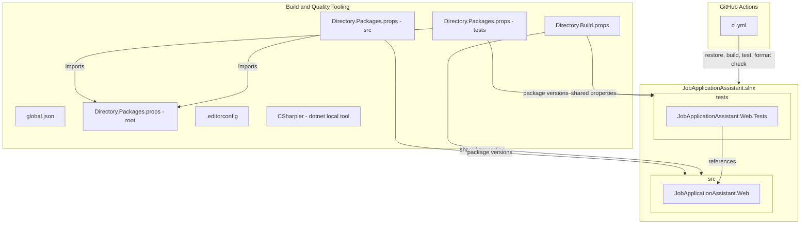

# Design Document: create-foundation

## Overview

**Purpose**: This feature delivers the foundational project structure, build tooling, CI/CD pipeline, and application shell for the Job Application Assistant. It establishes the scaffolding required before any feature development begins.

**Users**: Developers on the project will utilize this foundation for all subsequent feature development, ensuring consistent conventions, automated quality enforcement, and a deployable baseline.

**Impact**: Transforms an empty repository into a fully operational .NET 10 Blazor solution with automated CI, code quality tooling, and test infrastructure.

### Goals
- Establish a .NET 10 solution with vertical slice architecture conventions
- Configure automated code formatting and static analysis from day one
- Enable deterministic, reproducible builds with locked dependency management
- Provide a CI pipeline that validates builds, tests, and formatting on every change
- Deliver a minimal running Blazor application as a deployable baseline
- Set up test infrastructure with mocking support ready for feature development

### Non-Goals
- Feature-specific UI components beyond a landing page
- Authentication or authorization setup
- Database or persistence layer configuration
- WebAssembly or client-side rendering support
- Production deployment pipeline (CD)

## Architecture

### Architecture Pattern & Boundary Map

The foundation follows vertical slice architecture as defined in steering. At this stage, the architecture is minimal — a single Blazor Web App project and a corresponding test project.

**Architecture Integration**:
- Selected pattern: Vertical slice architecture — each future feature is self-contained with its own endpoint, handler, and domain logic
- Domain/feature boundaries: Not yet applicable; foundation provides the shell for future slices under `Features/`
- Existing patterns preserved: None (greenfield)
- New components rationale: Minimal set required to satisfy all six requirement groups
- Steering compliance: Aligns with tech.md (nullable, warnings-as-errors, CSharpier, xUnit, NSubstitute) and structure.md (vertical slices, PascalCase naming)

### Technology Stack

| Layer | Choice / Version | Role in Feature | Notes |
|-------|------------------|-----------------|-------|
| Frontend | Blazor Interactive Server (.NET 10) | Application shell with landing page | Single project, no .Client needed |
| Runtime | .NET 10 SDK | Build, run, test | LTS release, version pinned via global.json |
| Code Formatting | CSharpier 1.2.6 | Opinionated C# formatting | dotnet local tool, 120 char line width |
| Static Analysis | Meziantou.Analyzer 3.0.15 | Additional code quality rules | PrivateAssets=all, source projects only |
| Static Analysis | .NET Recommended Analyzers | Default analyzer set | Enabled via AnalysisLevel in Directory.Build.props |
| Testing | xUnit v3 3.2.2 | Unit and integration tests | xunit.v3 meta-package |
| Testing | NSubstitute 5.3.0 | Dependency mocking | For interface-driven test doubles |
| CI/CD | GitHub Actions | Automated build, test, format check | actions/setup-dotnet reads global.json |

## Requirements Traceability

| Requirement | Summary | Components | Interfaces | Flows |
|-------------|---------|------------|------------|-------|
| 1.1 | Solution file at repo root | SolutionStructure | — | — |
| 1.2 | Blazor web project under src/ | WebAppProject | — | — |
| 1.3 | Test project under tests/ | TestProject | — | — |
| 1.4 | Nullable reference types enabled | BuildPropsConfig | — | — |
| 1.5 | Warnings as errors | BuildPropsConfig | — | — |
| 1.6 | Directory.Build.props for shared properties | BuildPropsConfig | — | — |
| 2.1 | CSharpier as dotnet local tool | CSharpierTooling | — | — |
| 2.2 | .editorconfig with code style rules | EditorConfigFile | — | — |
| 2.3 | Meziantou.Analyzer in source projects | DependencyManagement | — | — |
| 2.4 | .NET recommended analyzers enabled | BuildPropsConfig | — | — |
| 2.5 | No CSharpier formatting violations | CSharpierTooling | — | CI Flow |
| 3.1 | NuGet lock files per project | DependencyManagement | — | — |
| 3.2 | Locked-mode restore | DependencyManagement | — | CI Flow |
| 3.3 | Central Package Management | DependencyManagement | — | — |
| 4.1 | GitHub Actions workflow on push/PR | CIPipeline | — | CI Flow |
| 4.2 | CI restores with locked mode | CIPipeline | — | CI Flow |
| 4.3 | CI builds with warnings as errors | CIPipeline | — | CI Flow |
| 4.4 | CI runs tests | CIPipeline | — | CI Flow |
| 4.5 | CI checks CSharpier formatting | CIPipeline | — | CI Flow |
| 5.1 | Landing page at root URL | BlazorAppShell | — | — |
| 5.2 | Blazor interactive server-side rendering | BlazorAppShell | — | — |
| 5.3 | Layout with header showing app name | BlazorAppShell | — | — |
| 5.4 | Accessible on configured HTTP port | BlazorAppShell | — | — |
| 6.1 | xUnit as test framework | TestProject | — | — |
| 6.2 | NSubstitute for mocking | TestProject | — | — |
| 6.3 | At least one passing smoke test | TestProject | — | — |
| 6.4 | dotnet test discovers and runs tests | TestProject | — | CI Flow |

## Components and Interfaces

| Component | Domain/Layer | Intent | Req Coverage | Key Dependencies | Contracts |
|-----------|--------------|--------|--------------|------------------|-----------|
| SolutionStructure | Infrastructure | Solution file and project layout | 1.1 | — | — |
| GlobalJsonConfig | Infrastructure | Pin SDK version and disallow pre-release | 1.2 | — | — |
| BuildPropsConfig | Infrastructure | Shared MSBuild properties and analyzers | 1.4, 1.5, 1.6, 2.4 | — | — |
| DependencyManagement | Infrastructure | Central package versions, lock files, and global package references | 2.3, 3.1, 3.2, 3.3 | — | — |
| EditorConfigFile | Infrastructure | Code style rules for editors and analyzers | 2.2 | — | — |
| CSharpierTooling | Infrastructure | Code formatting enforcement | 2.1, 2.5 | — | — |
| WebAppProject | Application | Blazor web application project | 1.2, 5.1–5.4 | .NET 10 SDK (P0) | — |
| BlazorAppShell | UI | Landing page, layout, routing | 5.1, 5.2, 5.3, 5.4 | WebAppProject (P0) | — |
| TestProject | Testing | Test project with xUnit and NSubstitute | 1.3, 6.1–6.4 | WebAppProject (P0) | — |
| CIPipeline | CI/CD | GitHub Actions workflow | 4.1–4.5 | All above (P0) | — |

### Infrastructure

#### SolutionStructure

| Field | Detail |
|-------|--------|
| Intent | Define the .NET solution file at repository root referencing all projects |
| Requirements | 1.1 |

**Responsibilities & Constraints**
- Solution file (`JobApplicationAssistant.slnx`) at repository root
- References `src/JobApplicationAssistant.Web/JobApplicationAssistant.Web.csproj` and `tests/JobApplicationAssistant.Web.Tests/JobApplicationAssistant.Web.Tests.csproj`
- Solution folders mirror physical directory structure

**Implementation Notes**
- Created via `dotnet new sln` (generates `.slnx` by default in .NET 10) and `dotnet sln add`
- SLNX is the XML-based solution format, default for .NET 10; replaces the legacy `.sln` text format
- Solution name matches repository purpose

#### GlobalJsonConfig

| Field | Detail |
|-------|--------|
| Intent | Pin the .NET SDK version and disallow pre-release SDKs for deterministic builds |
| Requirements | 1.2 |

**Responsibilities & Constraints**
- `global.json` at repository root
- Sets `sdk.version` to the specific .NET 10 SDK version used by the project
- Sets `sdk.allowPrerelease` to `false` to prevent accidental use of preview SDKs
- Sets `sdk.rollForward` to `latestPatch` to allow patch-level updates while pinning the major/minor version

**Implementation Notes**
- The `global.json` file is the single source of truth for the SDK version across local development and CI
- The CI pipeline references `global.json` via `actions/setup-dotnet@v4` `global-json-file` parameter instead of specifying `dotnet-version` directly, ensuring local and CI SDK versions stay in sync

#### BuildPropsConfig

| Field | Detail |
|-------|--------|
| Intent | Centralize shared MSBuild properties and analyzer configuration across all projects |
| Requirements | 1.4, 1.5, 1.6, 2.4 |

**Responsibilities & Constraints**
- `Directory.Build.props` at repository root
- Enables `<Nullable>enable</Nullable>` for all projects
- Sets `<TreatWarningsAsErrors>true</TreatWarningsAsErrors>` for all projects
- Sets `<AnalysisLevel>latest-recommended</AnalysisLevel>` for .NET recommended analyzers
**Implementation Notes**
- Meziantou.Analyzer is included via `<GlobalPackageReference>` in `src/Directory.Packages.props`, automatically applying to all source projects without per-project `<PackageReference>` entries or MSBuild conditions

#### DependencyManagement

| Field | Detail |
|-------|--------|
| Intent | Centralize NuGet package versions, global package references, and enable deterministic restores |
| Requirements | 2.3, 3.1, 3.2, 3.3 |

**Responsibilities & Constraints**
- Three `Directory.Packages.props` files organized hierarchically:
  - **Root** (`Directory.Packages.props`): sets `<ManagePackageVersionsCentrally>true</ManagePackageVersionsCentrally>`, no package versions (configuration only)
  - **Source** (`src/Directory.Packages.props`): imports root, defines source-specific package versions
  - **Tests** (`tests/Directory.Packages.props`): imports root, defines test-specific package versions
- CPM evaluates the closest `Directory.Packages.props` to each project; child files import the root via `<Import Project="$([MSBuild]::GetPathOfFileAbove('Directory.Packages.props', '$(MSBuildThisFileDirectory)..'))" />`
- `<RestorePackagesWithLockFile>true</RestorePackagesWithLockFile>` in `Directory.Build.props` to generate `packages.lock.json` per project
- Projects use `<PackageReference>` without `Version` attribute

**Source packages** (`src/Directory.Packages.props`):

| Package | Version | Type | Purpose |
|---------|---------|------|---------|
| Meziantou.Analyzer | 3.0.15 | `GlobalPackageReference` | Additional code quality rules, auto-applied to all source projects |

**Test package versions** (`tests/Directory.Packages.props`):

| Package | Version | Purpose |
|---------|---------|---------|
| xunit.v3 | 3.2.2 | Test framework |
| xunit.runner.visualstudio | 3.0.2 | VSTest adapter for dotnet test |
| NSubstitute | 5.3.0 | Dependency mocking |
| Microsoft.NET.Test.Sdk | 17.13.0 | Test SDK integration |

**Implementation Notes**
- Lock files committed to source control for reproducibility
- CI uses `dotnet restore --locked-mode` to enforce determinism
- Separation keeps source and test dependencies clearly scoped; adding a package to one group does not require touching the other

#### EditorConfigFile

| Field | Detail |
|-------|--------|
| Intent | Define code style rules for editors and analyzers consistent with project conventions |
| Requirements | 2.2 |

**Responsibilities & Constraints**
- `.editorconfig` at repository root
- Defines C# naming conventions: PascalCase for types, methods, properties; camelCase for locals and parameters; `_camelCase` for private fields; `I` prefix for interfaces
- Sets indentation (4 spaces), charset (UTF-8), end-of-line preferences
- Configures `using` directive ordering and placement
- Aligns with CSharpier formatting (CSharpier handles layout; .editorconfig handles naming and semantic rules)

**Implementation Notes**
- CSharpier overrides formatting rules; .editorconfig focuses on naming conventions, `using` placement, and analyzer severity overrides

#### CSharpierTooling

| Field | Detail |
|-------|--------|
| Intent | Provide opinionated code formatting via CSharpier as a dotnet local tool |
| Requirements | 2.1, 2.5 |

**Responsibilities & Constraints**
- `.config/dotnet-tools.json` manifest with CSharpier 1.2.6
- `.csharpierrc.yaml` configuration: `printWidth: 120`
- All generated code passes `dotnet csharpier --check .` with zero violations

**Implementation Notes**
- Developers run `dotnet csharpier .` to format; CI runs `dotnet csharpier --check .` to validate
- Tool restore via `dotnet tool restore` in CI

### Application

#### WebAppProject

| Field | Detail |
|-------|--------|
| Intent | Blazor Web App project targeting .NET 10 with interactive server-side rendering |
| Requirements | 1.2, 5.1, 5.2, 5.3, 5.4 |

**Responsibilities & Constraints**
- Project file: `src/JobApplicationAssistant.Web/JobApplicationAssistant.Web.csproj`
- Targets `net10.0`
- SDK: `Microsoft.NET.Sdk.Web`
- Configures Blazor interactive server-side rendering via `AddRazorComponents().AddInteractiveServerComponents()` and `MapRazorComponents<App>().AddInteractiveServerRenderMode()`

**Implementation Notes**
- Project follows Blazor Web App template structure
- Root namespace: `JobApplicationAssistant.Web`
- Features directory (`Features/`) created but empty, ready for vertical slices

#### BlazorAppShell

| Field | Detail |
|-------|--------|
| Intent | Minimal Blazor application with landing page, layout, and routing |
| Requirements | 5.1, 5.2, 5.3, 5.4 |

**Responsibilities & Constraints**
- `App.razor`: Root component with HTML head, Routes component, and Blazor script tag
- `Routes.razor`: Router component for client-side navigation
- `Components/Layout/MainLayout.razor`: Layout with header displaying "Job Application Assistant"
- `Components/Pages/Home.razor`: Landing page at route `/`
- `_Imports.razor`: Shared using directives
- `Program.cs`: Application entry point with service and middleware configuration

**Key Blazor Components**:

| Component | Location | Purpose |
|-----------|----------|---------|
| App.razor | Components/ | Root component, HTML shell |
| Routes.razor | Components/ | Router configuration |
| MainLayout.razor | Components/Layout/ | Application layout with header |
| Home.razor | Components/Pages/ | Landing page at `/` |
| _Imports.razor | Components/ | Shared Razor directives |

**Implementation Notes**
- Minimal layout: header with app name, main content area
- No NavMenu or sidebar for the initial shell (simplest baseline)
- Interactive Server render mode applied at the application level
- Default `launchSettings.json` with configured HTTP port

### Testing

#### TestProject

| Field | Detail |
|-------|--------|
| Intent | Test project with xUnit v3 and NSubstitute, including smoke test |
| Requirements | 1.3, 6.1, 6.2, 6.3, 6.4 |

**Responsibilities & Constraints**
- Project file: `tests/JobApplicationAssistant.Web.Tests/JobApplicationAssistant.Web.Tests.csproj`
- Targets `net10.0`
- References xUnit v3, NSubstitute, and Microsoft.NET.Test.Sdk
- Contains at least one passing smoke test
- Project references `JobApplicationAssistant.Web` for testing

**Implementation Notes**
- Smoke test validates the test infrastructure works (e.g., a simple assertion)
- Test project mirrors source structure for future feature tests
- Root namespace: `JobApplicationAssistant.Web.Tests`

### CI/CD

#### CIPipeline

| Field | Detail |
|-------|--------|
| Intent | GitHub Actions workflow for automated build validation |
| Requirements | 4.1, 4.2, 4.3, 4.4, 4.5 |

**Responsibilities & Constraints**
- Workflow file: `.github/workflows/ci.yml`
- Triggers: `push` and `pull_request` events
- Runs on `ubuntu-latest`
- Steps execute sequentially: checkout → setup .NET (from global.json) → tool restore → format check → restore (locked-mode) → build → test

**Workflow Steps**:

| Step | Command | Purpose |
|------|---------|---------|
| Checkout | `actions/checkout@v4` | Clone repository |
| Setup .NET | `actions/setup-dotnet@v4` with `global-json-file: global.json` | Install .NET SDK version from global.json |
| Tool Restore | `dotnet tool restore` | Restore CSharpier local tool |
| Format Check | `dotnet csharpier --check .` | Validate code formatting (fast, no packages needed) |
| Cache NuGet | `actions/cache@v4` with key based on `packages.lock.json` files | Cache NuGet global-packages folder to speed up restores |
| Restore | `dotnet restore --locked-mode` | Deterministic package restore |
| Build | `dotnet build --no-restore -c Release` | Build with warnings as errors |
| Test | `dotnet test --no-build -c Release` | Execute all tests |

**Implementation Notes**
- Build configuration: Release for CI to match production behavior
- `--no-restore` and `--no-build` flags to avoid redundant work between steps
- Warnings-as-errors already set in Directory.Build.props, enforced during build step
- SDK version sourced from `global.json` via `global-json-file` parameter — no hardcoded version in workflow
- NuGet cache uses `actions/cache@v4` with path `~/.nuget/packages` and key derived from hashing `**/packages.lock.json` files; lock files guarantee cache correctness since `--locked-mode` ensures exact version match

## Testing Strategy

### Unit Tests
- Smoke test: validates test infrastructure works (simple assertion in xUnit v3)
- Future: feature handler tests using NSubstitute for dependency mocking

### Integration Tests
- Not applicable at foundation stage; infrastructure ready for future integration tests

### CI Validation
- Build compiles with zero warnings (warnings-as-errors)
- All tests pass via `dotnet test`
- CSharpier reports zero formatting violations
- Package restore succeeds in locked mode (no version drift)

## Error Handling

Not applicable at foundation stage. Error handling patterns are established per-feature in vertical slices.
